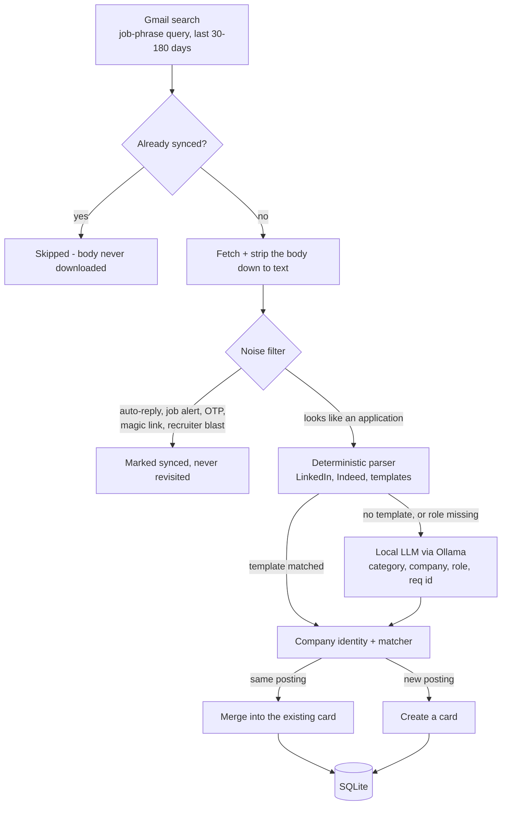

# Architecture & Development

How Job Tracker works under the UI, and how to build on it. For installing and using the app, see
the [main README](../README.md).

- [How It Works](#how-it-works): the sync pipeline, end to end
- [Where each stage lives](#where-each-stage-lives): pipeline stage → source file
- [Project structure](#project-structure)
- [Development](#development): tests, lint, builds, logs
- [CSV re-import spec](csv-reimport-spec.md): how an edited export is merged back in

## How It Works

One press of **Sync Gmail** runs every email through this:



The diagram simplifies one step. When a general template pulls out spans it can't type (is "your
interest in X" naming a company or a job title?), a cheap **picker** call types them without
re-reading the body, and only slides to the full classifier if it can't name a trustworthy employer.
So a template match doesn't always mean zero inference, and a classifier failure marks the email
`failed` rather than synced, so the next run retries it instead of losing it.

Three things that make it cheap and repeatable:

- **Already-synced message ids are dropped before any body is downloaded**, so a re-sync costs a
  single cheap list call plus whatever is genuinely new.
- **The parser runs before the LLM.** Templates handle a large share of a typical inbox at zero
  inference cost; the LLM only sees what's left, and sometimes only to fill in a role the parser
  couldn't read.
- **Classification is concurrent, merging is not.** Emails are classified with bounded concurrency
  (`SYNC_CONCURRENCY`, default 3) because that step reads nothing but its own text; the merge step
  is then sequential, so two emails can never race each other into duplicate cards.

Progress fans out to three places at once: newline-delimited JSON on the HTTP response for the tab
that started the sync, an `@sync-progress@` marker line on stdout that the desktop launcher renders,
and a server-side snapshot at `/api/gmail/sync/status` so a browser you closed and reopened picks the
run back up. Closing the tab never stops the sync.

## Where each stage lives

| Stage | File |
|---|---|
| Gmail query, rate-limited fetch, batched streaming | [`server/services/gmail/messages.ts`](../server/services/gmail/messages.ts) |
| HTML → readable text | [`server/services/gmail/body.ts`](../server/services/gmail/body.ts) |
| Noise filter (what never reaches the AI) | [`server/services/filters.ts`](../server/services/filters.ts) |
| Deterministic parser | [`server/services/parser/`](../server/services/parser) |
| Local LLM classifier + the prompt itself | [`server/services/classifier.ts`](../server/services/classifier.ts) |
| Company normalization, ATS-domain rejection | [`server/services/companyIdentity.ts`](../server/services/companyIdentity.ts) |
| "Which card does this email belong to?" | [`server/services/applicationMatcher.ts`](../server/services/applicationMatcher.ts) |
| Schema and all DB writes | [`server/services/db.ts`](../server/services/db.ts) |
| Sync orchestration and progress events | [`server/routes/gmail.ts`](../server/routes/gmail.ts) |
| Board, table, modals | [`client/src/components/`](../client/src/components) |
| Launcher: processes, Ollama, updates | [`desktop/src/`](../desktop/src) |

Two files repay reading first. [`filters.ts`](../server/services/filters.ts) is a commented list of
every kind of email that *looks* like an application but isn't, and
[`applicationMatcher.ts`](../server/services/applicationMatcher.ts) is where "one card per job" is
actually decided, including how it handles a company that spells its own name three different ways.

## Project structure

```
job-tracker/
├─ client/        React + Vite + Tailwind board and table UI
├─ server/        Express API, Gmail sync, parser, classifier, SQLite
│  ├─ routes/       /api/auth, /api/gmail, /api/applications
│  └─ services/     the pipeline above
├─ desktop/       Electron launcher: process control, Ollama, config, updates
├─ scripts/       Ollama bootstrap, server staging, packaging, uninstall prompt
└─ docs/          specs and README images
```

## Development

Setup is the same as the [run-from-source instructions](../README.md#step-2-option-b-run-from-source)
in the main README: a Google Cloud project, `npm run install:all`, and Ollama.

### Tests

Three separate suites. The root one covers the launcher only, so run all three:

```bash
npm test                   # desktop launcher (vitest)
npm --prefix server test   # parser, classifier, matcher, db, routes
npm --prefix client test   # components, hooks, CSV round-trip
```

All three also run in CI on any pull request to `main` or `release/**` that touches `client/`,
`server/`, or `desktop/`, via
[`.github/workflows/unit-tests.yml`](../.github/workflows/unit-tests.yml). Pushing straight to a
branch does not trigger them.

### Lint and types

```bash
npm --prefix server run lint       # add :fix to autofix
npm --prefix server run typecheck
npm --prefix client run lint
npm --prefix client run typecheck
```

### Build and package

| Command | What it does |
|---|---|
| `npm run dev` | Ollama check, then server (`tsx watch`) and Vite together in one terminal |
| `npm run desktop` | Builds the client and launcher, then runs Electron |
| `npm run desktop:local-ollama` | Same, but kills any system Ollama first so the launcher exercises its own portable install |
| `npm run package` | Full Windows installer + portable zip into `release/velopack/` |
| `npm run release` | Same as `package`, then uploads to a GitHub release **draft** for you to review and publish |

### Logs

The server writes one file pair per day: `debug-YYYY-MM-DD.log` for the run record, and
`error-YYYY-MM-DD.log` for warnings and errors. The error file is only created when something
actually goes wrong, so a clean day leaves none.

**Debug logging** (the launcher's Config checkbox, or `DEBUG_LOG=true`) is the volume switch. Off,
you get sync milestones and any warning or error. On, you get the full per-email trace, which is
what you want when the classifier gets something wrong and you need to see the text it saw. Errors
are recorded either way.

Where the files land:

| Running | Location |
|---|---|
| From source | `server/logs/` |
| Installed | Per-user app-data folder; the launcher's **Logs** button opens it |
| Portable | `data/logs/` inside the extracted folder |
